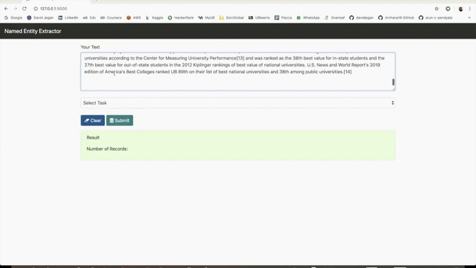
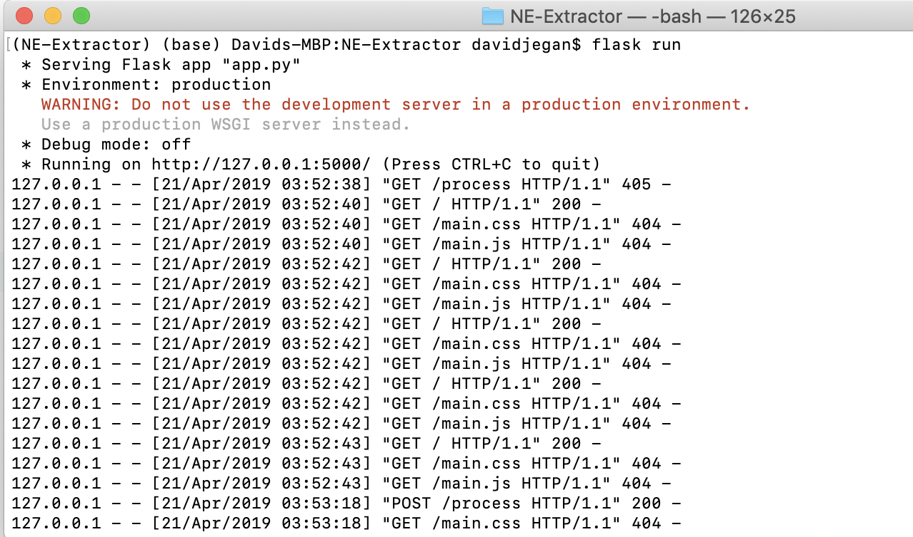

# NamedEntity-Extractor
A simple Flask app for named entity extraction using spaCy Model. 





To check whether, python has been installed successfully. try the following command.

    
    

Installing virtaulenv:
 This solves the elevated privillege issue as virtualenv allows you to install with user permission
```bash
    $ python -V
    $ sudo pip install virtualenv
    $ virtualenv --version
```  
Now lets create the first flask app in virtual environment. 
```shell
    $ mkdir ~/NE-Extractor
    $ cd ~/NE-Extractor
    $ virtualenv venv
    $ cd venv
    $ source bin/activate
```

Installing requirements in your virtaulenv
```shell

    $ pip install Flask
    $ pip install Spacy
    $ pip install pandas
    $ pip install requests
```
To run the application you can either use the flask command or python’s -m switch with Flask. Before you can do that you need to tell your terminal the application to work with by exporting the FLASK_APP environment variable:

```shell
$ export FLASK_APP=app.py
$ flask run
//Or you can use
$ export FLASK_APP=app.py
$ python -m flask run
```


# Results

Open the web browser with ```http://localhost:5000```




# Reference 
https://github.com/susanli2016
